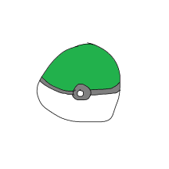
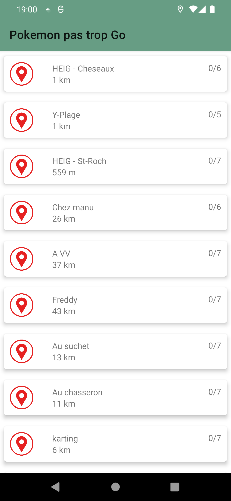
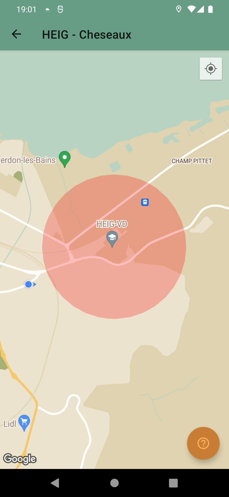
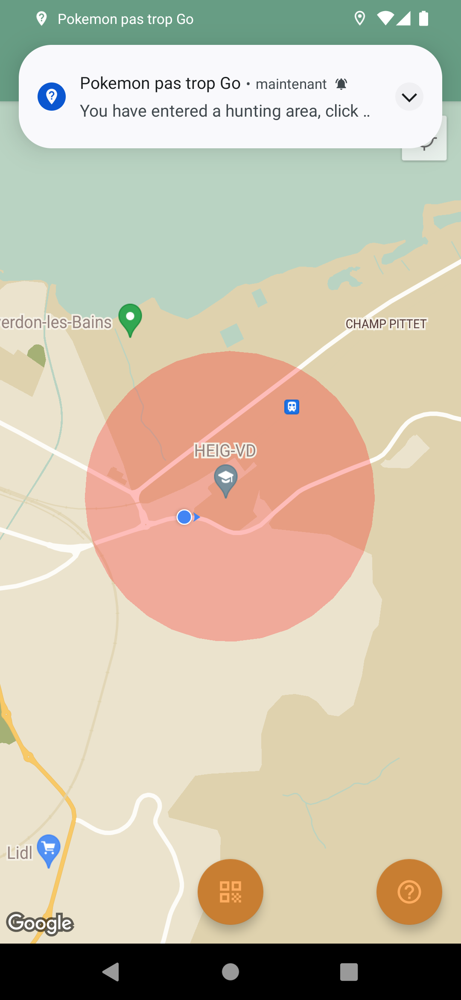
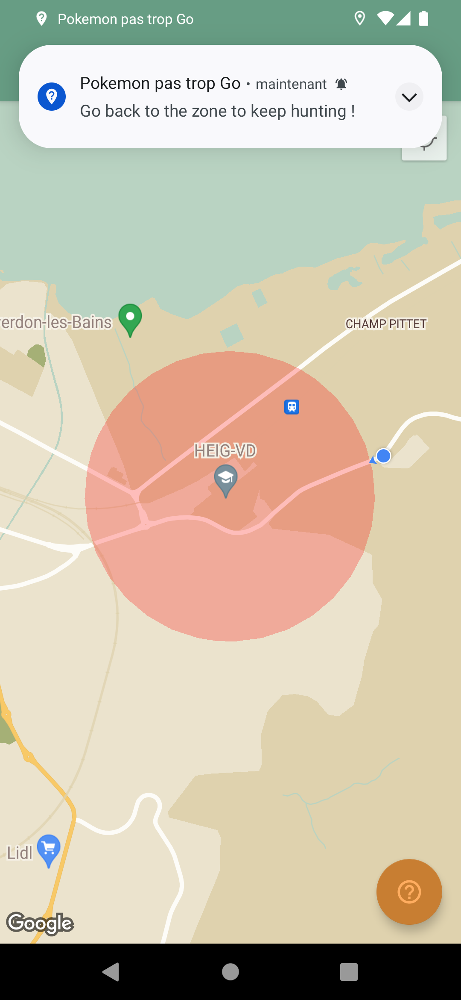
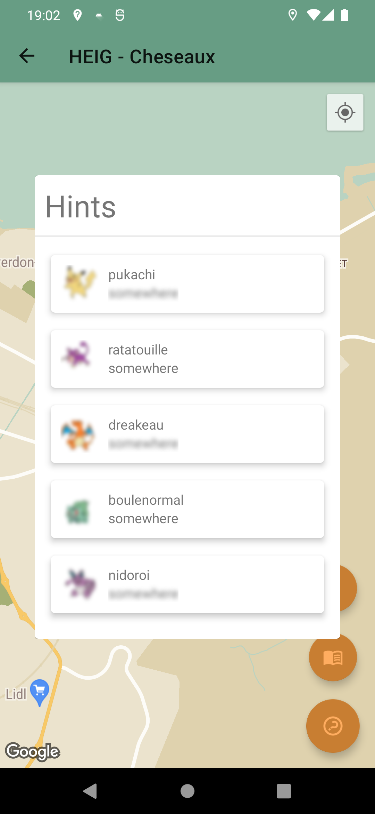
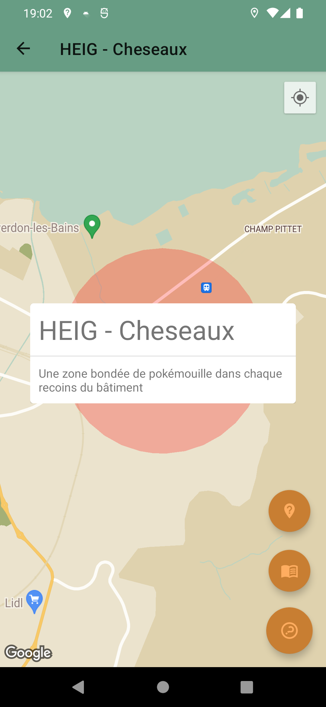

# Pokemon pas trop Go : Application Android de chasse aux trésors (QR-codes) à l'aide de Geofences

*Auteurs : Bonzon Ludovic, Janssens Emmanuel, Vaz Afonso Vitor - 12 juin 2022*

**Pokemon pas trop Go** est une application Android permettant de réaliser des **chasses aux trésors** 🏴‍☠️ dans le monde réel 🌍 en fournissant des zones (**geofences** 🛰) dans lesquelles il est possible de trouver des Pokémons (**QR-codes**) à scanner 📸. 

L'application **notifie l'utilisateur** lorsqu'il entre dans une zone remplie de pokémouilles et l'invite à partir à leur recherche 🕵️‍♀️🕵️‍♂️.

Chaque zone contient une **petite description** et un nombre variable de Pokémons à attraper, chacuns dotés d'un **indice** sur leur silhouette et leur position dans la zone.

Fonctionnalités avancées : *Geofencing, Base de données spatiales*

## Visuels

### Activité principale

*Liste des zones avec leur distance par rapport à notre position et le nombre de Pokémons trouvés/à trouver*

### Affichage de la zone

*Nous sommes en dehors de la zone, il n'est pas possible de scanner de QR-code, mais des infos sont disponibles avec le FAB*

### On entre dans la zone

*On reçoit une notification nous invitant à commencer la chasse, on peut désormais scanner des QR-codes*

### On sort de la zone

*On reçoit une notification nous invitant à revenir dans la zone et poursuivre la chasse, on ne peut plus scanner de QR-codes tant que l'on ne revient pas dans la zone*

### Indices sur les Pokémons à trouver dans la zone

*Les indices sont floutés de base, un simple appui permet de révéler la position. La silhouette reste floue. Une fois le Pokémon scanné, sa silhouette apparaît en clair*

### Description de la zone

*On peut en apprendre plus sur la zone sélectionnée*

## Remarques

- Notre application utilise une carte Google Maps, il est donc nécessaire de posséder une **clé d'API Google Maps** pour que tout fonctionne. Merci de nous contacter si vous souhaitez avoir accès à notre clé utilisée pendant le développement.

- **3 permissions** sont nécessaires pour l'exécution de notre application :
	- **android.permission.CAMERA** pour pouvoir scanner les QR-codes
   - **android.permission.ACCESS FINE LOCATION** pour afficher notre position précise sur la carte
   - **android.permission.ACCESS BACKGROUND LOCATION** pour la gestion des geofences, et notamment les transitions enter, dwell et exit

Il est donc nécessaire de choisir "Always allow" pour cette dernière, et non pas juste "While the app is running".

- Les **QR-codes à scanner** sont dans le dossier `qrcodes/` à la racine du dossier du projet. Le nom correspond au Pokémon à chasser, et le numéro à la zone (dans l'ordre de la liste telle qu'elle est affichée sur l'activité principale).